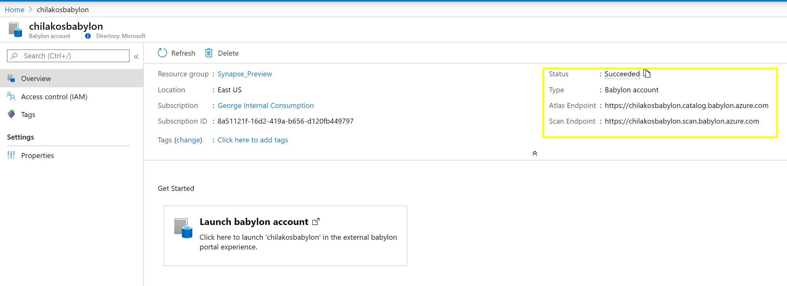

## Detect Database Classifications using Atlas API and Setup Scans with Babylon API

This repo contains two samples
- [catalog-scan-trigger](./catalog-scan-trigger) sample .net core app that calls Babylon API to setup DataSource and schedule the scan or run it immediately
- [catalog-results-scanner](./catalog-results-scanner) sample .net core app that calls Atlas API to find classified columns in the tables on Azure SQL server databases ( results of the scheduled or runed scans)
- [rest-apis](./rest-apis) - open API (swagger) specifications for Babylon and Atlas APIs and generated calsses in C# and Java

For sample API calls JSON see Postman collection in this directory 

## Catalog Setup
- provision Babylon account - ARM template in this directory - and take note of API Urls

Solution works without the need for service principals ( only locally for debugging) and leverages MSI for all connections

- create User Managed Idenity and bind it to K8S Pod using AAD Pod Identity, it will be used to get Token to invoke Atlas and Babylon API. Add it to Babylon Catalog Adminstrators

- Babylon Catalog is provisioned with system assigned Identity, add it to Azure SQL Server admin group to give it access to scan databases. To find the system identity Id navigate to Babylon account properties

