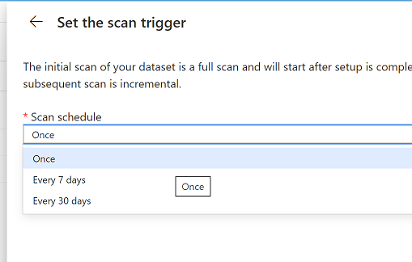
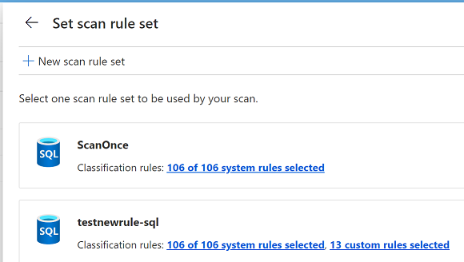

## Detect Database Classifications using Atlas API and Azure Gen2 DataCatalog

Catalog Scanner is application that queries ADC Gen2 catalog to find classified columns for the datasources with scheduled (or run manually) scans.
These columns could then  be reported to Log Analytics for further reporting.

## Settings

To run locally , set `appsettings.json` configuration with details for Service Princial and Azure SQL
```
{
  "TenantId": "<SP Tenant Id>",
  "ClientId": "<SP Client ID>",
  "ClientSecret": "<SP Secret>",
  "SqlServer": "<sql server>.database.windows.net"
}
```

## Managed Identity
if running in K8S with AAD Pod Identity enabled

```
"UseMI": "true",
```

Add SP  or MI App Id to DataCatalog Contributors


And run
```
> dotnet run 

DataCatalogResultsScanner Loaded.
info: catalog_scanner.DataCatalogResultsScanner[0]
      Found classifications in table mssql://srv.database.windows.net/testae/dbo/data3
       --- Column  mssql://srv.database.windows.net/testae/dbo/data3#hhh --- Classification SECURITY.COMMON_PASSWORDS
       --- Column  mssql://srv.database.windows.net/testae/dbo/data3#numero%20d%27assurance%20sociale --- Classification GOVERNMENT.CANADA.SOCIAL_INSURANCE_NUMBER

## Run as Kubernetes CronJob
To run this job periodically use Kubernetes CronJob  `k8sjob.yaml` definition

- First create ConfigMap with settings to mapped to container, e.g

```sh
kubectl create configmap catalogscanner-settings --from-file appsettings.Development.json
```

- Create Job
```sh
kubectl apply -f k8sjob.yaml
```

Job definition

```yaml
apiVersion: batch/v1beta1
kind: CronJob
metadata:
  name: catalogscanner
spec:
  schedule: "* */1 * * *"
  jobTemplate:
    spec:
      completions: 1  #at least one success
      backoffLimit: 3 #retries
      template:
        metadata:
          labels:
            aadpodidbinding: odbcidentity
        spec:
          containers:
          - name: catalogscanner
            image: lenisha/catalogscanner
            volumeMounts:
            - name: config
              mountPath: /app/appsettings.json
              subPath: appsettings.Development.json
          restartPolicy: OnFailure
          securityContext:
            runAsUser: 1000
            runAsGroup: 3000
          ## kubectl create configmap catalogscanner-settings --from-file appsettings.Development.json
          volumes:
          - name: config 
            configMap:
              name: catalogscanner-settings   
```

when running, see job defined and completed runs
```
 kubectl get cronjobs
NAME         SCHEDULE      SUSPEND   ACTIVE   LAST SCHEDULE   AGE
catalogscanner   * */1 * * *   False     0        26s             6m31s
```

## Onboard DataSource

Navigate to ADC management portal `https://adc.azure.com/`  and setup new datasource pointing to Azure SQL database


Setup new scan, using DataCatalog ManagedIdentity (should be granted access to Azure SQL) or SQL authentication


setup schedule and rulest to be used by scan



to Find out DataCatalog MSI to add to Azure SQL Admin group, navigate in portal to DataCatalog properties


