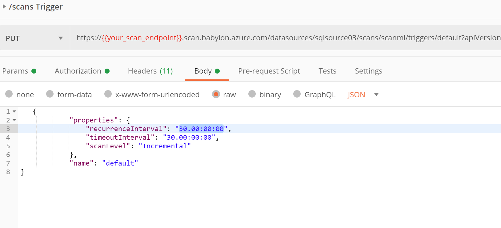

## Setup AzureDB Scanning using Babylon DataCatalog API

Catalog Scan Trigger is application that sets up scanning AzureSQL datasources with scheduled (or run manually) scans.

API sample in this example creates DataSource, Scan with Managed Idenity and sets Schedule to trigger scan every 7 days.
For testing purposes it also runs the scan ad hoc immediately.

This example could be used to setup each database scanning schedule - one time call, or use cronjob in K8S to trigger the scanning periodically.

## Settings

To run locally , set `appsettings.json` configuration with details for Service Princial and Azure SQL
```
{
  "ScanningServiceUrl": "https://<catalogname>.scan.babylon.azure.com",
  "ScanningDataSourceName": "",
  "TenantId": "",
  "ClientId": "",
  "ClientSecret": "",
  "SqlServer": "<dbsrv>.database.windows.net",
  "SqlDb": "",
  "UseMI": "false"
}
```

## Managed Identity
if running in K8S with AAD Pod Identity enabled and remove ClientID/ClientSecret

```
"UseMI": "true",
```

Add SP  or Managed Application Id to Catalog Administrators


And run

```
> dotnet run 
Scan Trigger Client
DataCatalogScanTrigger Loaded.
info: catalog_scan_trigger.DataCatalogScanTrigger[0]
      Scan created datasources/apidatasource/scans/scan_637238783965627010
info: catalog_scan_trigger.DataCatalogScanTrigger[0]
      Trigger scheduled datasources/apidatasource/scans/scan_637238783965627010/triggers/default Time (null)
info: catalog_scan_trigger.DataCatalogScanTrigger[0]
      Scan Run now status Accepted
```

## Run as Kubernetes CronJob
To run this job periodically use Kubernetes CronJob  `k8sjob.yaml` definition

- First create ConfigMap with settings to mapped to container, e.g

```sh
kubectl create configmap catalogscantrigger-settings --from-file appsettings.Development.json
```

- Create Job
```sh
kubectl apply -f k8sjob.yaml
```

Job definition

```yaml
apiVersion: batch/v1beta1
kind: CronJob
metadata:
  name: catalogscantrigger
spec:
  schedule: "* */1 * * *"
  jobTemplate:
    spec:
      completions: 1  #at least one success
      backoffLimit: 3 #retries
      template:
        metadata:
          labels:
            aadpodidbinding: odbcidentity
        spec:
          containers:
          - name: catalogscantrigger
            image: lenisha/catalogscantrigger
            volumeMounts:
            - name: config
              mountPath: /app/appsettings.json
              subPath: appsettings.Development.json
          restartPolicy: OnFailure
          securityContext:
            runAsUser: 1000
            runAsGroup: 3000
          ## kubectl create configmap catalogscantrigger-settings --from-file appsettings.Development.json
          volumes:
          - name: config 
            configMap:
              name: catalogscantrigger-settings   
```

when running, see job defined and completed runs
```
 kubectl get cronjobs
NAME         SCHEDULE      SUSPEND   ACTIVE   LAST SCHEDULE   AGE
catalogscantrigger   * */1 * * *   False     0        26s             6m31s
```

## JSON requests
Babylon API follows a CRUD scheme to create and update DataSources and Scans

- This sample first creates Datasource


- Then creates Scan


- and Creates Trigger to schedule scans every week


## Verify in Portal

Launch Babylon portal `https://https://web.babylon.azure.com/resource/<catalog>/`  verify datasource pointing to Azure SQL database and the scans scheduled


each scan will use DataCatalog ManagedIdentity (should be granted access to Azure SQL) 


to Find out DataCatalog MSI to add to Azure SQL Admin group, navigate in portal to DataCatalog properties


## Code Generation

Code generation from Babylon API Swagger package was done using autorest

```
npm install -g autorest
autorest --input-file=./scanningService.json --csharp --output-folder=Csharp_ScannerService --namespace=ScannerBabylonService --add-credential

```

[Installing Autorest](https://github.com/Azure/autorest/blob/master/docs/installing-autorest.md)